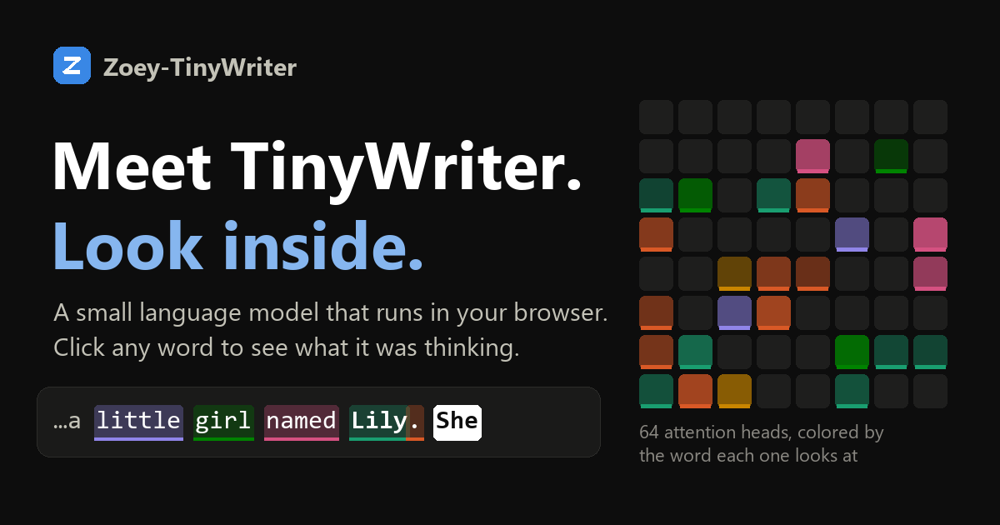

# Zoey-TinyWriter

**A glass-box language model. Watch it think.**

[](https://ryanleeupc.github.io/Zoey-TinyWriter/)

TinyWriter is a small language model (27.5M parameters) that writes children's stories. It works like the AI chatbots you know, just thousands of times smaller, so you can see every step. It runs entirely in your browser, and you can click any word it writes to look inside:

- **What it expected next**: its top guesses, with probabilities
- **Where it was looking**: all 64 attention heads, and which earlier words each one focused on. Watch a head link "she" back to "Lily".
- **How the answer formed**: what TinyWriter would have said after each of its 8 layers

Open **TinyWriter's dictionary** to see what it knows about any single word: the 512 numbers it learned for that word, the words it considers most similar (to TinyWriter, "dog" sits next to "puppy", "cat", and the dog names "Spot" and "Max"), and a map of all 4,096 tokens it knows.

Then replay **how TinyWriter learned**: 87 minutes of training, from random word salad to real stories.

> **Just want to look?** Open [ryanleeupc.github.io/Zoey-TinyWriter](https://ryanleeupc.github.io/Zoey-TinyWriter/). No install, no account, nothing leaves your computer.

## How it works

Everything is built from scratch, and short enough to read:

| Piece | Where |
|---|---|
| Byte-pair-encoding tokenizer | [`zoey/bpe.py`](zoey/bpe.py) |
| GPT-style transformer (PyTorch) | [`zoey/models/gpt.py`](zoey/models/gpt.py) |
| Training loop, with snapshots for the replay | [`zoey/train.py`](zoey/train.py), [`zoey/trace.py`](zoey/trace.py) |
| Export to 8-bit browser weights, plus the Dictionary's word map | [`zoey/export.py`](zoey/export.py) |
| The same transformer in TypeScript, running in your browser | [`viewer/src/engine/model.ts`](viewer/src/engine/model.ts) |
| The viewer (React) | [`viewer/src`](viewer/src) |

The browser engine is about 300 lines of plain TypeScript with no ML library. Tests check that it produces the same numbers as PyTorch.

TinyWriter was trained on [TinyStories](https://arxiv.org/abs/2305.07759), 2.7M short stories (about 550M tokens), for 87 minutes on one RTX 4090. It read the whole collection about 3.6 times: 2 billion tokens in all. The weights are stored as 8-bit integers (a 28 MB download), which changes its accuracy by less than 0.05%.

## Run it yourself

You need [uv](https://docs.astral.sh/uv/) (Python) and [Node.js](https://nodejs.org/) 22.12 or newer.

```bash
# The viewer, with the bundled TinyWriter
cd viewer
npm install
npm run dev          # then open http://localhost:5173
```

To train your own TinyWriter (about 1 h 40 min on an RTX 4090; downloads 2.2 GB of stories):

```bash
uv sync
uv run python -m zoey.bpe --vocab-size 4096       # train the tokenizer (seconds)
uv run python -m zoey.train configs/zoey.toml     # train the model, recording snapshots
uv run python -m zoey.export zoey                 # package it for the browser
```

Tests: `uv run pytest` (Python) and `npm test` in `viewer/` (browser engine vs PyTorch).

## Project layout

```
configs/        the training configuration
zoey/           Python: tokenizer, model, training, export
viewer/         the React app
  src/engine/     the in-browser transformer, tokenizer, and worker
  src/explore/    the Explore page (story + inspector)
  src/dictionary/ the Dictionary page (embeddings, similar words, word map)
  public/models/  exported model weights
  public/runs/    recorded training snapshots
tokenizers/     trained tokenizers
tests/          Python tests
.github/        deploys the viewer to GitHub Pages on every push to main
```

The training snapshots that the replay page reads are written by [`zoey/trace.py`](zoey/trace.py); their format is defined by the types in [`viewer/src/lib/types.ts`](viewer/src/lib/types.ts).

## Credits and prior work

Zoey-TinyWriter builds on great work by others. If you like it, go check these out:

- Andrej Karpathy's [nanoGPT](https://github.com/karpathy/nanoGPT), [minbpe](https://github.com/karpathy/minbpe), and the *Let's build GPT* video
- Sebastian Raschka's [*Build a Large Language Model (From Scratch)*](https://github.com/rasbt/LLMs-from-scratch)
- [Transformer Explainer](https://poloclub.github.io/transformer-explainer/) (Georgia Tech Polo Club) and Brendan Bycroft's [LLM Visualization](https://bbycroft.net/llm)
- [TransformerLens](https://github.com/TransformerLensOrg/TransformerLens) and Anthropic's [Transformer Circuits](https://transformer-circuits.pub/) research on what happens inside transformers
- The [TinyStories](https://arxiv.org/abs/2305.07759) dataset by Ronen Eldan & Yuanzhi Li ([CDLA-Sharing-1.0](https://huggingface.co/datasets/roneneldan/TinyStories)). It isn't included in this repo; the training scripts download it from Hugging Face.

## License

MIT. See [LICENSE](LICENSE).
